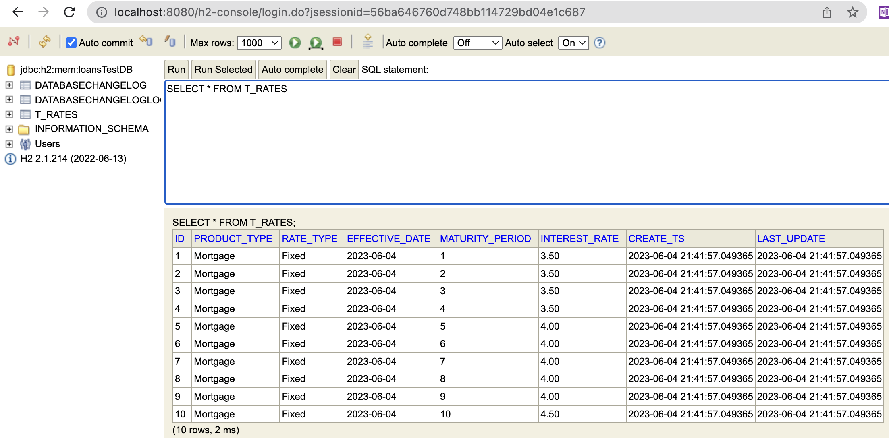
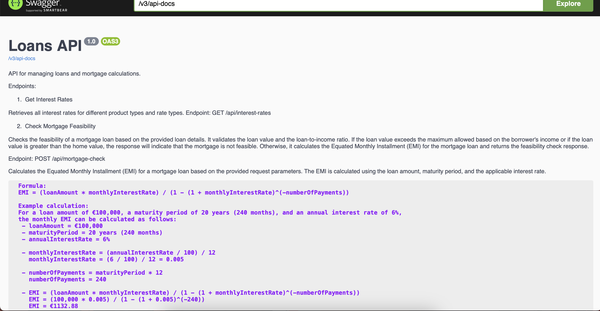

# Loans Service API

The API provides two main endpoints: "Get all interest rates" and "Mortgage check." Below is a detailed description of each endpoint.

#### Get all interest Rates
* Method: GET 
* Endpoint: http://localhost:8080/api/interest-rates

This API retrieves all the interest rates from the rate table(`t_rates`), which is created at the start of the application using Liquibase. The rate table stores the different interest rates available.

The application uses an in-memory H2 database with the following details:

    URL to access H2: http://localhost:8080/h2-console
    JDBC URL: jdbc:h2:mem:loansTestDB
    Username: sa
    Password:



#### Check mortgage feasibility

* Method : POST
* Endpoint : http://localhost:8080/api/mortgage-check

Checks the feasibility of a mortgage loan based on the provided loan details. It validates the loan value and the loan-to-income ratio. If the loan value exceeds the maximum allowed based on the borrower's income or if the loan value is greater than the home value, the response will indicate that the mortgage is not feasible. Otherwise, it calculates the Equated Monthly Installment (EMI) for the mortgage loan and returns the feasibility check response.

Formula:
EMI = (loanAmount * monthlyInterestRate) / (1 - (1 + monthlyInterestRate)^(-numberOfPayments))

## EMI Calculation

The EMI (Equated Monthly Installment) for a mortgage loan can be calculated using the following formula:


Example Calculation:

For a loan amount of €100,000, a maturity period of 20 years (240 months), and an annual interest rate of 6%:

```
- loanAmount = €100,000
- maturityPeriod = 20 years (240 months)
- annualInterestRate = 6%
```

Calculating the monthly interest rate:

```
monthlyInterestRate = (annualInterestRate / 100) / 12
monthlyInterestRate = (6 / 100) / 12 = 0.005
```

Calculating the number of payments:

```
numberOfPayments = maturityPeriod * 12
numberOfPayments = 240
```

Substituting the values into the formula:

```
EMI = (loanAmount * monthlyInterestRate) / (1 - (1 + monthlyInterestRate)^(-numberOfPayments))
EMI = (100,000 * 0.005) / (1 - (1 + 0.005)^(-240)) 
EMI ≈ €1132.88
```

This calculation shows that for the given loan details, the monthly EMI amount would be approximately €1132.88.

## Implemented Swagger for documentation 

Endpoint : http://localhost:8080/swagger-ui.html



Finally, I have implemented spring boot profiles which will be used to disable swagger in the production environment

Note: By default I have used dev profile and can be changed in application.yml to change it to prod. Also, we can use swagger or postman to access these rest endpoints